# Hola! 👋

 

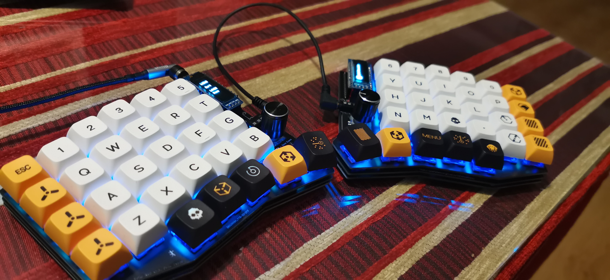

> Si es la primera vez que visitas este repo (o no lo es y esta guía te está ayudando de alguna manera), no olvides darle una estrellita ⭐ para consultarla en futuras ocasiones y ver cuanta gente la ha utilizado. ¡Gracias! ❤️

## Tabla de contenidos

- [Antes de empezar](#antes-de-empezar)
  - [Recursos](#recursos)
  - [Consejos](#consejos)
- [Componentes](#componentes)

# Antes de empezar

🚧 Actualmente la guía está en construcción, y se irá ampliando conforme vaya teniendo más tiempo.
Durante el proceso iré adjuntando diferentes links que son de gran utilidad y que otros compañeros del mundo del teclado han ido subiendo.

🚨 **Quiero dejar claro que no soy para nada un experto en esto, no me hago responsable de absolutamente nada. Simplemente dejo esta guía por internet para ayudar a aquellos que están empezando en este mundo.**

## Recursos

> ℹ️ En esta sección iré dejando los links, archivos, .hex, etc. que sean interesantes. Esta sección la dejaré la primera para que no se pierdan dentro de la guía.

- [Guía oficial de Josefadamcik](https://josefadamcik.github.io/SofleKeyboard/build_guide_rgb.html)
- [Guía oficial traducida al español](https://zonekeyboards.cl/assembly-sofle-rgb)
- [Guía paso a paso con fotos](https://docs.beekeeb.com/build-guide/sofle-rgb-v2.1-soflekeyboard-build-log-guide-with-photos)
- [Documentación de QMK](https://docs.qmk.fm/#/)
- [Configurador de QMK (con el layout del Sofle)](https://config.qmk.fm/#/sofle/rev1/LAYOUT)
- [Gerbers de la PCB](https://github.com/josefadamcik/SofleKeyboard/tree/master/Gerbers/RGB)
- [Guía visual de buenas prácticas en soldadura](https://hacedores.com/13-problemas-de-soldadura-de-pcbs/)
- [Tamaños de los componentes SMD](https://eulerprecision.com/es/nuestra-tarjeta-de-visita-para-ingenieros/)
- [Hex: Via]()

🚧 ...

## Consejos

Los consejos que voy a dejar son muy obvios, pero no está de más recordarlos. Estos consejos son los que yo he seguido y que me han ayudado a no equivocarme en el montaje del teclado.

- **Marcalo todo**: Es muy recomendable marcar cada mitad del teclado (parte superior izquierda, superior derecha, etc.). Esto te ayudará a no equivocarte a la hora de montar el teclado.

- **No te apresures**: No te apresures a montar el teclado. Toma tu tiempo y no te precipites. Equivocarte en una soldadura puede ser un problema irreversible.

- **Verifica todo**: Antes de comenzar a soldar algo, verifica que todo esté bien. Si no estás seguro, no lo hagas.

- **Investiga**: Antes de comenzar a hacer algo, no dudes en investigar. De nuevo, si no estás seguro de algo, no lo hagas.

# Componentes

> ℹ️ Esta sección contendrá la lista de todos los componentes que he utilizado para el montaje del teclado, así como el precio de cada componente de forma aproximada.

Los componentes que he utilizado son los siguientes:

| # | Obligatorio | Componente | Precio | Link | Comentarios |
| --- | --- | --- | --- | --- | --- |
| 1 | Si | *2x* [PCB](./docs/components/PCB.md) | 4'32€ | - | Pedido a JLCPCB |
| 2 | Si | *2x* Plate superior | - | - | Pedido a JLCPCB junto con la PCB |
| 3 | Si | *2x* Plate inferior | - | - | Pedido a JLCPCB junto con la PCB |
| 4 | Si | *58x* [Switch](./docs/components/Switch.md) | 24'51€ | [Link](https://es.aliexpress.com/item/1005003746169161.html) | Pedido en AliExpress. El precio es de dos cajas de 45 unidades cada una. Los mios son unos [Akko CS Lavanda](https://en.akkogear.com/product/akko-cs-lavender-purple-switch-45pcs/). |
| 5 | Si | *58x* [Keycap](./docs/components/Keycap.md) | 20'05€ | [Link](https://es.aliexpress.com/item/1005004192847697.html) | Pedido en AliExpress. El precio es de un pack completo de teclas en Inglés. |
| 6 | Si | *58x* Kailh Hotswap Socket | 8'44€ | [Link](https://es.aliexpress.com/item/1005002637150446.html) | Pedido en AliExpress en un gran lote. |
| 7 | Si | *2x* [Pro Micro (con pin header)](./docs/components/Promicro.md) | 11'03€ | [Link](https://es.aliexpress.com/item/1005001622051348.html) | Pedido en AliExpress. |
| 8 | No | *4x* Socket Header (12 pines) | 0'45€ | [Link](https://es.aliexpress.com/item/1005001610366695.html) | Es opcional, pero es muy recomendable. |
| 9 | Si | *1x* Cable USB C | 4€ | [Link](https://es.aliexpress.com/item/1005003776565766.html) | No es necesario adquirir un cable USB C super especial. Cualquier cable USB C que tengas por casa te servirá. |
| 10 | Si | *2x* Conector TRRS | 0'54€ | [Link](https://es.aliexpress.com/item/33029465106.html) | Precio de la conjunta |
| 11 | Si | *1x* Cable TRRS | 1'43€ | [Link](https://es.aliexpress.com/item/4000104350398.html) | Precio de la conjunta |
| 12 | Si | *60x* Diodos 1N4148W | 0'92€ | [Link](https://es.aliexpress.com/item/1005004617332808.html) | Precio de la conjunta |
| 13 | Si | *2x* Botón reset | 0'33€ | [Link](https://es.aliexpress.com/item/32976590241.html) | Precio de la conjunta |
| 14 | Si | *28x* Tornillo M2 (3mm) | 0'66€ | [Link](https://es.aliexpress.com/item/32810852732.html) | Precio de la conjunta |
| 15 | Si | *14x* Separador M2 (7mm) | 0'95€ | [Link](https://es.aliexpress.com/item/1005004286356432.html) | Pedido en AliExpress. Venían 50 unidades |
| 16 | Si | *10x* Pata de goma | 1€ | - | Pedido en tienda local |
| 17 | No | *2x* Pantalla OLED (128x32) (con pin header) | 5'31€ | [Link](https://es.aliexpress.com/item/32879702750.html) | Pedido en AliExpress |
| 18 |  | *2x* Socket Header (4 pines) | 1€ | - | Pedido en tienda local. Se compró uno largo y se cortó a medida. |
| 19 | No | *2x* Potenciometro EC11 (con knob) | 4'50€ | [Link](https://es.aliexpress.com/item/10000056483250.html) | Pedido en AliExpress (un pedido para los encoders y otro para los knobs). Venían 5 unidades en cada pedido. |
| 20 | No | *72x* LED SK6812 | 4'44€ | [Link](https://es.aliexpress.com/item/32782295214.html) | Pedido en conjunta |
| 21 | No | *1x* Funda | 14€ | [Link](https://es.aliexpress.com/item/1005003426184729.html) | Pedido en AliExpress |
| Total |  | - | **107'88€**| - | - |

🚧 ...

# Montaje

> ℹ️ Esta sección contendrá los pasos que he seguido para el montaje del teclado. Los pasos que vienen son los recomendados por varios compañeros, que bajo su experiencia, ha significado un montaje más sencillo.

Hay dos formas de montar el teclado:

- **La segura**: Consiste en soldar primero los componentes imprescindibles (switches, diodos, Pro Micro, etc) y luego soldar los componentes opcionales (pantalla OLED, encoders, LEDs, etc). De esta forma puedes comprobar en todo momento que todo funciona correctamente. Es más dificil de soldar por que el promicro estorba desde el principio, pero es la forma más segura de montar el teclado.

    1. Soldamos los componentes imprescindibles (`diodos, socket header, promicro`), instalamos el firmware y comprobamos que todo funciona correctamente.

    2. Soldamos los componentes opcionales (`pantalla OLED, encoders, LEDs, etc`) y, por cada componente soldado, comprobamos que todo sigue funcionando correctamente (sobre todo en el caso de los LEDs, que recomiendo ir comprobando cada vez que soldamos un LED nuevo)

- **La cómoda**: Consiste en soldar los componentes de forma que la soldadura sea lo más sencilla posible. De esta forma, puedes soldar los componentes opcionales sin tener que soldar el promicro. Es menos dificil de soldar, pero puede dar verdaderos dolores de cabeza en caso de error.

    - El orden de soldadura sería: `diodos, LEDs, socket headers, reset, TRRS, promicro, OLED, encoders`

En mi caso, he seguido la segunda forma, ya que era la primera vez que soldaba y quería que el proceso fuera lo más sencillo posible.

## 1.- Diodos

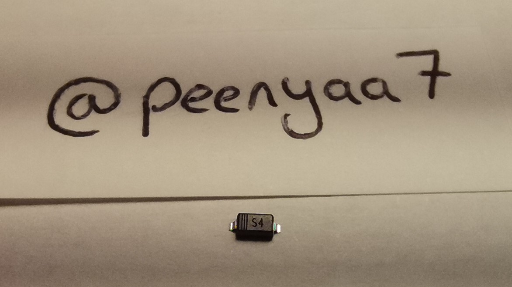

Los diodos van soldados en la parte inferior de cada parte (la parte que está mirando a la mesa). Hay que tener en cuenta que los diodos tienen una posición correcta, ya que si se colocan al revés, no funcionarán correctamente. En la siguiente imagen se puede ver la posición correcta de los diodos:

En la placa, en cada posición de diodo, hay una pequeña marca que indica la posición correcta del diodo:

<!-- TODO: Foto de la placa con las marcas de los diodos -->

En la guía oficial aparece que son necesarios 58 diodos, pero en mi caso he utilizado 60 diodos (30 en cada mitad), no se si esto es un error de la guía oficial.

Cómo consejo, recomiendo separar 30 diodos por mitad antes de comenzar a soldar, ya que es muy fácil confundirse y soldar un diodo de menos o de más.

### Proceso de soldadura

Los diodos son muy sencillos de soldar. El proceso es el siguiente:

1. Aplicar soldadura en uno de los pines del diodo
2. Soldar el diodo únicamente con el pin que hemos soldado (lo más recto posible)
3. Aplicar soldadura en el otro pin del diodo

🚧 ...

## 2.- LEDs

> ⚠️ **Nota**: Este teclado permite **no** utilizar LEDs si así se desea. Si este es tu caso, ver al apartado [Puentes LEDs](#puentes-leds) directamente.

El Sofle RGB utiliza LEDs con el siguiente esquema de conexiones:

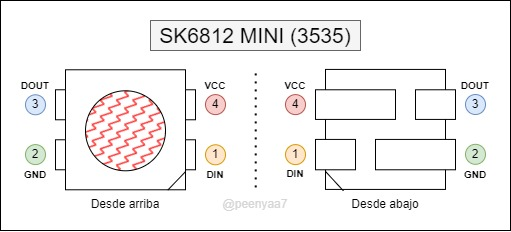

<!-- Fotos de los pads -->

El Sofle RGB tiene 3 "tipos de LEDs":

- **LED indicador**: Hay 1 por cada mitad. Se situa en la parte superior de la PCB, justo al lado del TRRS. En mi caso es optado por no utilizarlo, ya que no lo veo necesario (toda la información que ofrece me la puede ofrecer la pantalla OLED).

- **LEDs underglow**: Hay 6 por cada mitad. Se situan en la parte inferior de la PCB. Tienen un montaje superficial, lo que hace más complicado el proceso de soldadura.

- **LEDs backlight**: Hay 29 por cada mitad. Se situa en los huecos de la PCB, justo debajo de cada switch. Tienen un montaje incrustado, lo que facilita el proceso de soldadura.

> ℹ️ En la guía oficial aparece que son necesarios 58 LEDs, pero en mi caso he utilizado 60 LEDs (30 en cada mitad), no se si esto es un error de la guía oficial.

### Antes de soldar (a tener en cuenta)

Este apartado lo considero muy importante, ya que es muy fácil cometer errores al soldar los LEDs. Por ello, recomiendo leerlo detenidamente antes de comenzar a soldar.

A tener en cuenta:

- Es muy importante verificar, antes de soldar un LED, que este se encuentra en la posición correcta. Créeme, es muy fácil confundirse pensar que un LED está en la posición correcta cuando en realidad no lo está.
- Los LEDs son muy sensibles a la temperatura, es muy fácil quemarlos si no se tiene cuidado (una temperatura de 240/260ºC es sufuciente)
- En ocasiones, un LED puede llegar con dos esquinas rotas y confundir dicha esquina con la muesca del LED. Es recomendable no utilizar este tipo de LEDs si tenemos LEDs de sobra.

> 🚨 **Importante**: La marca de la PCB (silk screen) se refiere al pin DOUT del LED. No tiene por qué coincidir con la muesca del LED (de hecho, no coincide en mi caso).

### Proceso de soldadura (backlight/per-key/in-switch)

Estos LEDs son los que están situados justo debajo de cada switch y son los que iluminan cada una de las teclas. Estos LEDs son los más fáciles de soldar, ya que no hay que sujetarlos (se encajan en el hueco de la PCB).

El proceso de soldadura es el siguiente:

1. Encajar el LED en el hueco de la tecla (aseguarse de que el LED está en la posición correcta)

2. Aplicar suficiente soldadura en uno de los pads de la PCB y acto seguido, arrastrar la punta del soldador desde el pad con el estaño hasta el LED (sin soltar la punta del soldador).

3. Pasar al siguiente LED y repetir el proceso. Es recomendable que solo hagamos un pad de cada LED, ya que si hacemos dos pads a la vez, es muy probable que se nos queme el LED. Una vez tengamos el primer pad de cada LED, podemos hacer el segundo pad de cada LED (en el mismo orden).

### Proceso de soldadura (underglow)

Estos LEDs son los que están situados en la parte inferior de la PCB y son los que iluminan el teclado por debajo. Estos LEDs son los más difíciles de soldar, ya que van soldador en la superficie inferior de la PCB y hay que sujetarlos con una pinza.

El proceso de soldadura es el siguiente:

1. Soldar uno de los pads de la PCB
2. Sujetar el LED con una pinza en la posición correcta (asegurarse de que las demás patas del LED coinciden con los demás pads de la PCB)
3. Volver a aplicar calor en el pad con estaño de la PCB y unir el LED a la PCB
4. Repetir el proceso para los demás LEDs (soldar solo un pad de cada LED)
5. Una vez tengamos todos los pads de los LEDs soldados, volver a soldar los demás pads de los LEDs (en el mismo orden)

> ℹ️ **Pro tip**
>
> Si el primer pad que soldamos en cada uno de los LED es el pad DOUT, nos estamos asegurando de que, si en un futuro, un LED no enciende correctamente, se debe al pin DIN del LED que no funciona correctamente.

### Puentes LEDs

El Sofle RGB permite decidir si queremos LEDs o no. Y en caso de querer LEDs, podemos decidir si queremos LEDs backlight o LEDs underglow. Por lo tanto, en la PCB hay puentes que nos permiten decidir si queremos o no queremos LEDs.

El objetivo de este documento no es hacer una guía universal para cualquier tipo de configuración de LEDs, sino que se centra en la configuración que yo he utilizado en mi teclado. Por lo tanto, si tienes una configuración distinta a la mía, te recomiendo que leas le guía oficial.

Aun así, explicaré brevemente las distintas opciones de configuración de LEDs que hay en la PCB.

---

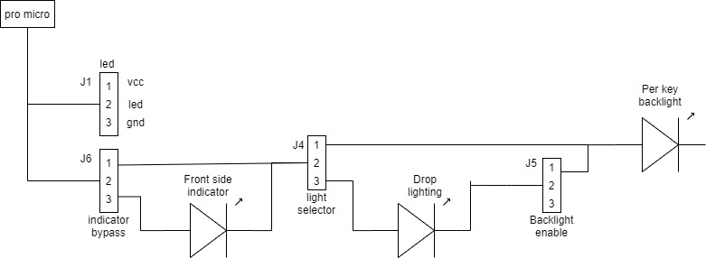

En la PCB hay 3 puentes que nos permiten decidir si queremos o no queremos LEDs:

- **Indicator bypass (j6)**: Se situa justo al lado del Promicro. Siempre debe ser soldado (excepto si no queremos ningún LED en nuestro sofle). Con este puente indicamos si queremos o no queremos el LED indicador.

- **Light Selector (j4)**: Se situa en el centro de la PCB. Con este puente indicamos si queremos o no queremos LEDs underglow.

- **Backlight Enable (j5)**: Se situa en el centro de la PCB. Con este puente indicamos si queremos o no queremos LEDs backlight. Este puente no es necesario que sea soldado si no tenemos LEDs underglow.

A continuación, dejo una tabla con las conexiones que se deben hacer en cada uno de los puentes según la configuración de LEDs deseada:

| ¿Quiere LED indicador? | ¿Quiere LED underglow? | ¿Quiere LED backlight? | Puente J6 | Puente J4 | Puente J5 | |
|:----------------------:|:----------------------:|:----------------------:|:------------------------:|:-----------------------:|:-------------------------:| --- |
| ❌ | ❌ | ❌ | --- | --- | --- | |
| ❌ | ❌ | ✅ | 1-2 | 1-2 | --- | |
| ❌ | ✅ | ❌ | 1-2 | 2-3 | --- | |
| ❌ | ✅ | ✅ | 1-2 | 2-3 | 2-3 | ⬅️ |
| ✅ | ❌ | ❌ | 2-3 | --- | --- | |
| ✅ | ❌ | ✅ | 2-3 | 1-2 | --- | |
| ✅ | ✅ | ❌ | 2-3 | 2-3 | --- | |
| ✅ | ✅ | ✅ | 2-3 | 2-3 | 1-2 | |

En mi caso particular, he decidido que **no** quiero LEDs indicadores, quiero **si** LEDs underglow y **si** quiero LEDs backlight (configuración marcada con una flecha en la tabla anterior). Por lo tanto, he soldado los pines **1-2 de J6**, los pines **2-3 de J4** y los **pines 2-3 de J5** (tal y como se pueden ver en la foto de arriba).

> ℹ️ **Pro tip**
>
> Recomiendo utilizar un trozo de alambre cortado a la medida (con forma de U) para realizar las conexiones en cada uno de los puentes. Esto nos permitirá hacer conexiones más limpias, más fáciles y más seguras.

## 3.- Kailh Hotswap

Este componente es el que nos permite poner y quitar los switches de nuestro teclado tantas veces queramos sin tener que soldarlos. Se situa justo donde van colocados los switches, y son soldados en la parte inferior de la PCB (la parte que estará mirando a la mesa cuando tengamos el teclado montado).

Son muy fáciles de soldar, ya que no se trata de un componente electrónico y tiene una gran superficie de contacto con la PCB.

El proceso de soldadura de cada Hotswap es el siguiente:

1. Aplicar estaño a un pad de la PCB
2. Colocar el Hotswap en la posición correcta (asegurarse de que las demás patas del Hotswap coinciden con los demás pads de la PCB)
3. Apretar con la punta del soldador en el pad que hemos aplicado estaño hasta que se funda con el estaño de la PCB
4. Aplicar suficiente estaño en la otra pata del hotswap, hasta que el estaño fije la patita del hotswap en la PCB

> ⚠️ **Atención**: Es muy fácil confundirse con la colocación de este componente, ya que la PCB es reversible y por tanto, tiene dos posiciones posibles. Por este motivo recomiendo que se verifique antes de ser soldado.
>
> A continuación, un pequeño esquema de como colocar el componente y para que sirve cada agujero:
>
> 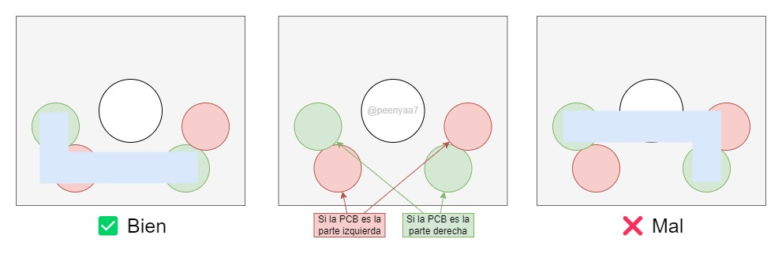

<!-- Foto del pad -->

## 4.- Reset

El botón de reset no es un componente obligatorio, pero si recomiendo mucho tenerlo (sobretodo si nunca hemos tenido un teclado como este o nunca hemos configurado QMK). Este botón nos permite entrar en modo RESET para poder cargar nuestros propios firmwares en el teclado.

Cada mitad del Sofle RGB requiere de 1 botón de reset. Se situa en la parte superior de la PCB, justo encima del TRRS.

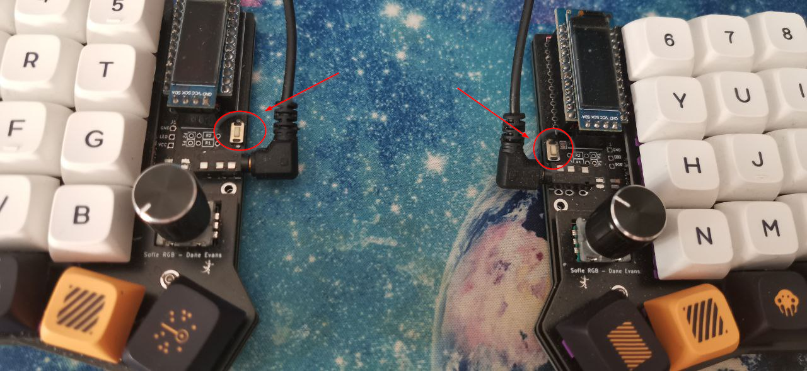

Es un componente muy sencillo de soldar, pero es muy probable que se quede torcido si no se hace con cuidado. Si se queda torcido no ocurre nada, pero no se queda todo lo bonito que podría quedar.

Recomiendo seguir los siguientes pasos para soldar el botón de reset:

1. Doblar las patas del botón de reset hacia abajo, de modo que se quede anclado a la PCB como si de una pinza se tratara (esto nos facilitará el soldado)
2. Sujetar el botón de reset con cualquier pinza que nos permita soldarlo sin esfuerzo extra (una pinza de la ropa puede ser suficiente)
3. Soldamos unas de las patas del botón de reset
4. Quitamos la pinza y soldamos la otra pata del botón de reset
5. (Opcional) Le damos la vuelta a la PCB y aplicamos estaño extra a los mismos pads que hemos soldado anteriormente para mayor anclaje.

<!-- Foto del pad -->

## 5.- TRRS

Este componente es el que nos permite conectar las dos mitades del teclado. Se situa en la parte superior de la PCB, justo al lado del botón de reset.

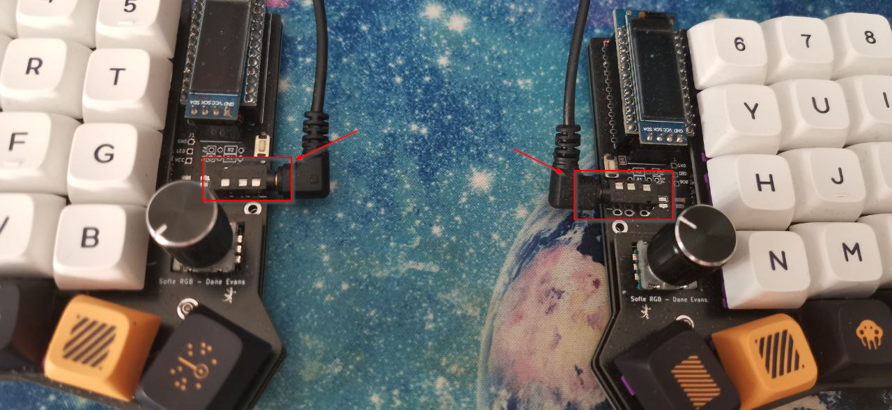

Los TRRS son muy fáciles de soldar, ya que no se trata de un componente electrónico y tiene una gran superficie de contacto con la PCB. Aunque hay que tener en cuenta que, como la PCB es reversible, hay que soldarlos en la posición correcta. Fijaros como quedan totalmente opuestos:

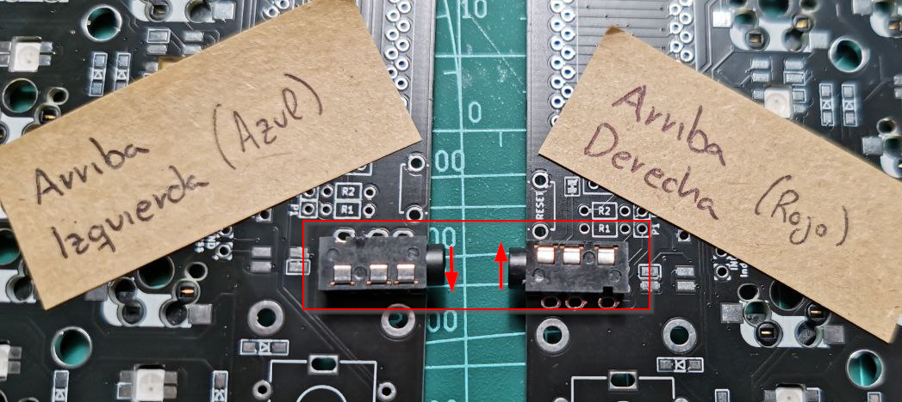

El proceso de soldadura de cada TRRS es el siguiente:

1. Colocar el TRRS en la posición correcta, es decir, verificar que todas las patas del TRRS se sitúan en los pads correctos de la PCB.
2. Sujetar el TRRS con una pinza para que no se mueva, comprobando que no nos moleste la pinza para soldar.
3. Soldar una de las patas del TRRS
4. Quitar la pinza
5. Soldar las demás patas del TRRS (aunque no sea un componente electrico, recomiendo soldar la siguiente pata más lejana a la que hemos soldado anteriormente, para evitar sobrecalentar el componente por esa zona)

<!-- Foto del pad -->

## X.- Puentes OLED

Este paso es necesario hacerlo antes de soldar el promicro, ya que nos será mucho más fácil hacerlo ahora que cuando tengamos los sockets header del promicro soldados.

Estos puentes se encuentran entre los pads del promicro y los pads de la pantalla OLED. De nuevo, como la PCB es reversible, estos puentes están tanto en la parte superior como en la parte inferior de la PCB, pero **ÚNICAMENTE** se deben soldar en el **LADO DONDE VAYA A IR COLOCADA LA PANTALLA OLED**.

Adjunto una imagen donde se pueden ver los 4 puentes OLED de cada mitad soldados en la parte superior de la PCB:

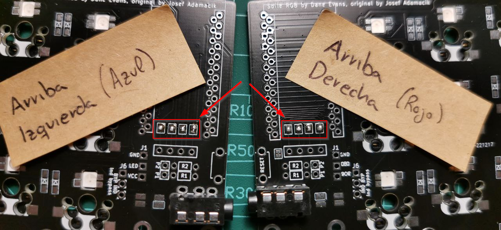

## 6.- Socket Header (promicro)

Este componente no es obligatorio, pero es extremadamente recomendable. Este componente nos permite conectar el promicro a la PCB sin tener que soldarlo. Esto nos permite poder cambiar el promicro en caso de que se estropee sin tener que desoldar nada.

Los Socket Header del promicro se situan en la parte superior de la PCB, justo encima del TRRS. Son muy fáciles de soldar, ya que no se trata de un componente electrónico y tiene una gran superficie de contacto con la PCB.

Aunque es muy fácil equivocarse con la posición de los Socket Header, ya que la PCB es reversible y por tanto, tiene dos posiciones posibles. Por este motivo recomiendo que se verifique antes de ser soldado (_es increible la de gente que se equivoca con esto..._).

En la PCB se puede ver (mirando la parte superior de ambas PCBs) que hay una marca que indica la posición correcta de los Socket Header:

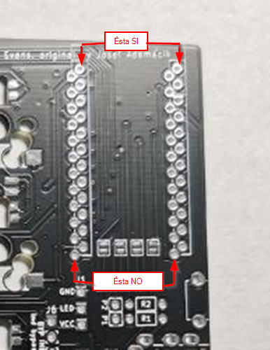

Al colocar los Socket Header, estos deben (por norma general) ocultar el dibujo de la PCB. Si no es así, verificar que los Socket Header están en la posición correcta. Una vez colocados deben quedar de la siguiente forma:

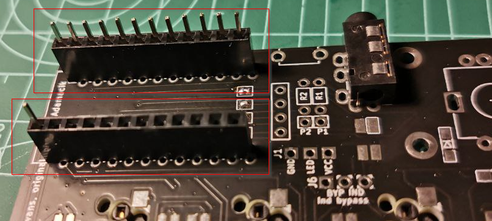

El proceso de soldadura de cada Socket Header es el siguiente:

1. En la parte superior, colocar el Socket Header en la posición correcta, es decir, verificar que todas las patas del Socket Header se sitúan en los pads correctos de la PCB.
2. Sujetar el Socket Header con una pinza o celo para que no se mueva, comprobando que no nos moleste la pinza para soldar.
3. En la parte inferior, soldar la primera y la última pata de cada Socket Header
4. Quitar la pinza
5. Soldar las demás patas del Socket Header (de nuevo, aunque no sea un componente electrico, recomiendo soldar la siguiente pata más lejana a la que hemos soldado anteriormente, para evitar sobrecalentar el componente por esa zona)

Si observamos la parte inferior de la PCB, las soldaduras deben quedar fuera del dibujo de la PCB, como se puede ver en la siguiente imagen:

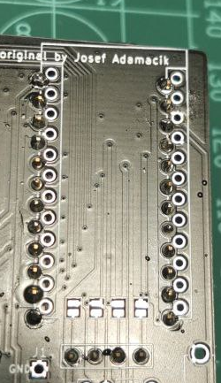

<!-- Foto del pad -->

## 7.- Promicro

El promicro es el componente que nos permite configurar el teclado. Se situa en la parte superior de la PCB, justo encima del TRRS y de los Socket Header.

### Modificación Pin Header

En mi caso me he visto obligado a modificar los Pin Header del promicro para que la pantalla OLED encaje correctamente. Para ello, he extraídos los pines del Pin Header y los he soldado directamente al promicro, evitando así el pequeño alzamiento que tienen los Pin Header.

El proceso es sencillo:

1. Extraer los pines del Pin Header
    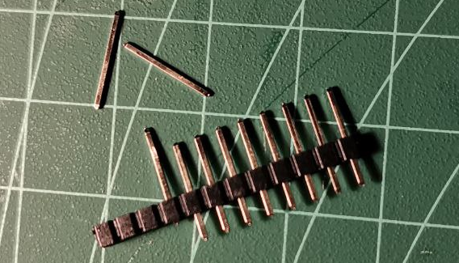

2. Colocar los pines en el Socket Header
3. Colocar el promicro en el Socket Header (encajando todos los pines y en la posición correcta. En el paso 5 hay una imagen que indica la posición correcta del promicro)
4. Soldar el primer y último pin del promicro
5. Soldar los demás pines del promicro (al ser un componente electrónico delicado recomiendo soldar siempre la siguiente pata más lejana a la que hemos soldado anteriormente, para evitar sobrecalentar el componente por esa zona. Incluso puede ser interesante ir cambiando entre varios Socket Header para evitar sobrecalentar el promicro)
    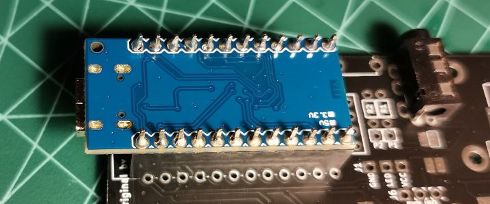

6. (Opcional) Cortar los pines que sobresalgan del promicro. En mi caso he decidido no hacerlo, ya que no me molestan y hacen que la pantalla OLED no se salga de la parte superior del promicro
7. Extraer el promicro del Socket Header para que no nos moleste en el resto del proceso.

<!-- Foto del pad -->

## 8.- Socket Header (OLED)

Este componente nos permite conectar la pantalla OLED a la PCB sin tener que soldarla. Esto nos permite poder cambiar la pantalla OLED en caso de que se estropee sin tener que desoldar nada.

Los Socket Header de la pantalla OLED se situan en la parte superior de la PCB, entre el promicro y el TRRS. Son muy fáciles de soldar, ya que no se trata de un componente electrónico y tiene una gran superficie de contacto con la PCB.

Van soldados en la misma dirección que los Socket Header del promicro, es decir, en la parte superior de las PCBs.

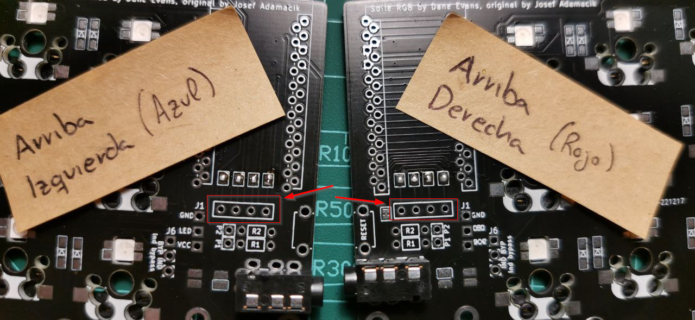

El proceso de soldadura de cada Socket Header es el siguiente:

1. En la parte superior, colocar el Socket Header en la posición correcta, es decir, verificar que todas las patas del Socket Header se sitúan en los pads correctos de la PCB.
2. Sujetar el Socket Header con una pinza o celo para que no se mueva, comprobando que no nos moleste la pinza para soldar.
3. En la parte inferior, soldar la primera y la última pata de cada Socket Header
4. Quitar la pinza o celo
5. Soldar las demás patas del Socket Header

Deben quedar de la siguiente forma:

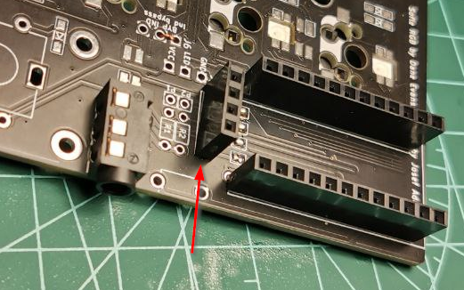

<!-- Foto del pad -->

## 9.- OLED

Este componente es el que nos permite ver información en el teclado de forma personalizada. Se situa en la parte superior de la PCB, justo encima del TRRS.

Normalmente, al adquirir una pantalla OLED, esta viene con un pin header soldado. Si en tu caso no viene con un pin header soldado, puedes adquirir uno en cualquier tienda de electrónica y soldarlo tu mismo.

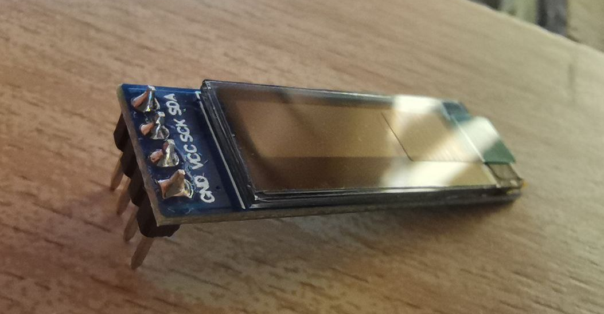

El proceso de soldadura de la pantalla OLED es el siguiente:

1. Colocar Pin Header en la pantalla OLED (justo como en la imagen anterior)
2. Sujetar Pin Header con una pinza o celo para que no se mueva, comprobando que no nos moleste la pinza para soldar.
3. Soldar la primera y la última pata de cada Pin Header
4. Quitar la pinza o celo
5. Soldar las demás patas del Pin Header

<!-- Foto del pad -->

## 10.- Encoders

<!-- Foto del pad -->

## 11.- Plate superior (+ separadores y tornillos)

<!-- Foto del pad -->

## 12.- Switches

<!-- Foto del pad -->

## 13.- Plate inferior (+ tornillos)

<!-- Foto del pad -->

## 14.- Pata de goma

## 15.- Funda

<!--
Explicar las dos formas de montarlo:
- La segura: Más dificil de soldar pero mejor resolución de errores
- La tryhard: Menos dificil de soldar pero puede dar verdaderos dolores de cabeza en caso de error
-->

🚧 ...

# Programación (QMK)

> ℹ️ Esta sección explicará de forma muy sencilla como hacer tu propio firmware y ejecutarlo en tu teclado.

## Sin programación

🚧 ...

## Con programación

🚧 ...

<!--
- Como hacer tus propios dibujos en la pantalla OLED
- Como subir una imagen personalizada a la pantalla OLED
-->

# Resolución de problemas

> ℹ️ Esta sección contendrá aquellos fallos más comunes, así como una pequeña lista de pasos que debes de seguir para acotar el problema en cuestión.

🚧 ...
