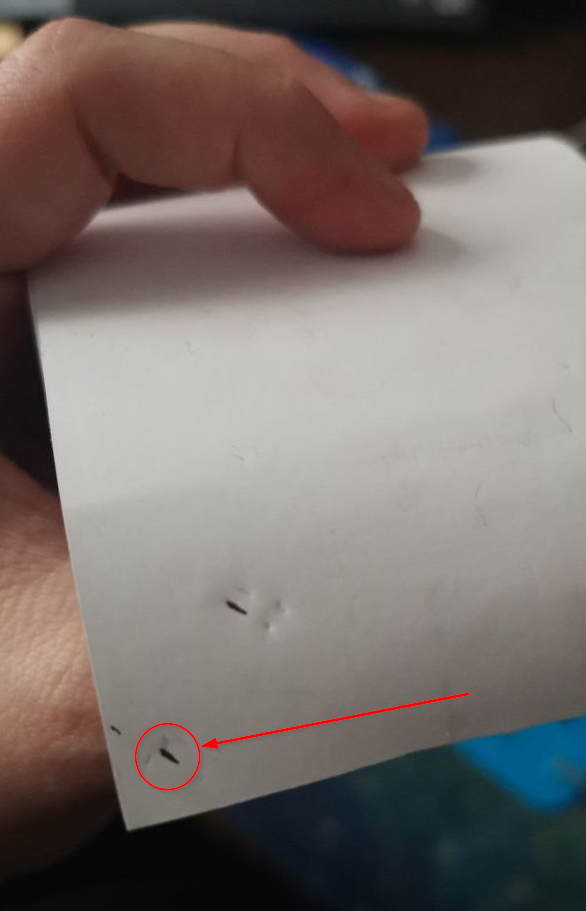
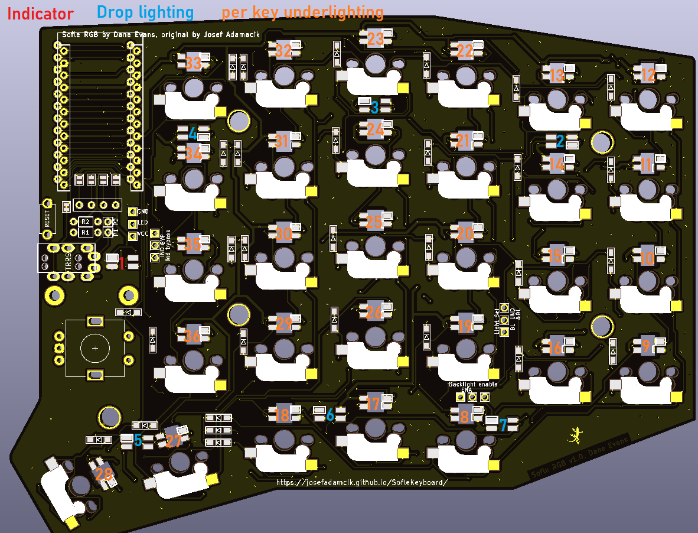
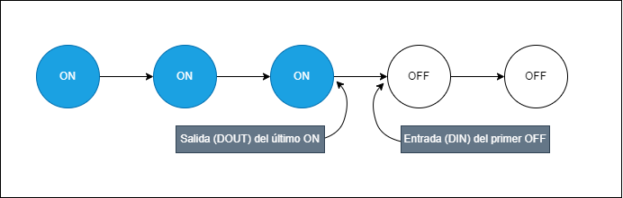

# Resolución de problemas

Aquí pondré una lista de problemas que me he encontrado durante el montaje del teclado, así como una pequeña lista de pasos que debes de seguir para acotar el problema en cuestión.

- [El promicro no se enciende](#el-promicro-no-se-enciende)
- [Solo funcionan algunos LEDs](#solo-funcionan-algunos-leds)

---

## El promicro no se enciende

Si el promicro enciende cuando no está conectado a la PCB, pero no enciende cuando está conectado a la PCB, es muy probable que tengas un **cortocircuito** en la PCB.

Para solucionar este problema, debemos comprobar:
- Que no hay ningún componente soldado en corto (una soldadura que toca dos pads distintos)
- Que no hay ningún componente soldado en la posición incorrecta (por ejemplo, un diodo al revés). Este motivo es el más común, sobretodo en los LEDs.

Si no encuentras el problema, puedes hacer un pequeño truco para encontrar el problema. Este truco consiste en utilizar un papel térmico (el que se utiliza para las cajas registradoras) y cubrir toda la PCB con él. Una vez cubierta, conectamos el promicro a la PCB y lo encendemos. Si el papel térmico se calienta en algún punto, es que hay un cortocircuito en ese punto.

## Solo funcionan algunos LEDs

Si solo funcionan algunos LEDs, es muy probable que tengas un LED mal soldado. Para solucionar este problema, debemos comprobar si los LEDs que están encendidos siguen el siguiente orden:

Si siguen el orden numérico pero deja de funcionar en un número arbitrario, lo más probable es que haya un problema de soldadura en "*la salida (DOUT) del último LED encendido*" o en "*la entrada (DIN) del primer LED apagado*". El siguiente diagrama puede ayudar a entenderlo:

